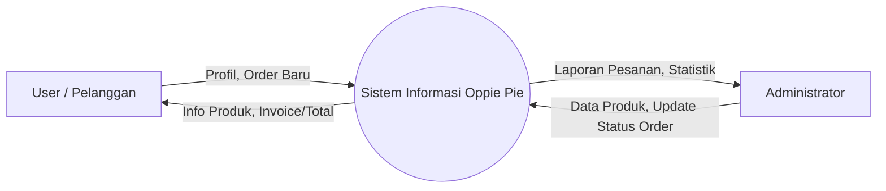
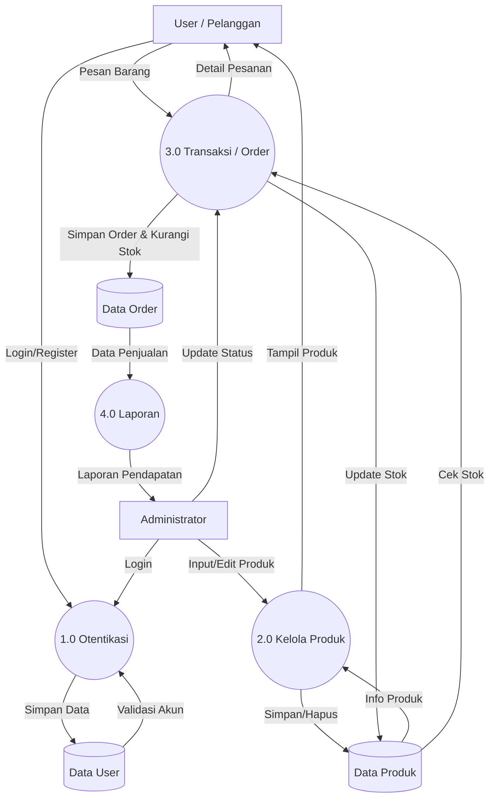

# Dokumentasi Sistem Oppie Pie

Berikut adalah dokumentasi lengkap alur sistem, termasuk Flowchart Naratif dan Data Flow Diagram (DFD).

## 1. Deskripsi Alur Sistem (Flowchart Naratif)

### A. Alur Belanja Pelanggan (User Shopping Flow)
1.  **Mulai**: Pengguna membuka aplikasi.
2.  **Lihat Produk**: Pengguna melihat daftar produk di Halaman Menu.
3.  **Tambah Keranjang**: Pengguna memilih produk dan sistem menyimpan ke keranjang sementara.
4.  **Checkout**: Pengguna melakukan checkout.
    *   *Validasi*: Sistem mewajibkan login. Jika belum, pengguna harus login/daftar.
5.  **Isi Data**: Pengguna mengisi form nama, alamat, dan no. HP.
6.  **Proses Order**: Pengguna klik "Pesan", sistem menyimpan order dan mengurangi stok.
7.  **Konfirmasi WA**: Sistem mengarahkan pengguna ke WhatsApp Admin dengan format pesan pesanan.
8.  **Selesai**.

### B. Alur Admin
1.  **Login**: Admin masuk ke sistem.
2.  **Kelola Produk**: Admin menambah, mengedit, atau menghapus data produk.
3.  **Kelola Order**: Admin mengubah status pesanan (Pending -> Processing -> Completed).
4.  **Laporan**: Admin melihat grafik pendapatan dan statistik penjualan.

---

## 2. Data Flow Diagram (DFD)

### DFD Level 0 (Diagram Konteks)

Diagram ini menggambarkan hubungan global antara sistem dengan entitas luar (User dan Admin).

### DFD Level 1 (Rincian Proses)

Diagram ini menjabarkan proses-proses utama yang terjadi di dalam sistem dan data yang mengalir ke database.

### Penjelasan DFD Level 1:
1.  **Proses 1.0 Otentikasi**: Menangani login dan registrasi baik untuk User maupun Admin. Data disimpan di tabel User.
2.  **Proses 2.0 Kelola Produk**: Admin menginput data produk. Data disimpan di tabel Product. User hanya melihat (read-only) data ini.
3.  **Proses 3.0 Transaksi**: User membuat pesanan. Sistem mengecek stok di tabel Product, menyimpan pesanan di tabel Order, dan mengurangi stok di tabel Product. Admin memverifikasi dan mengupdate status pesanan.
4.  **Proses 4.0 Laporan**: Mengambil data dari tabel Order untuk dihitung menjadi statistik pendapatan yang dilihat Admin.
